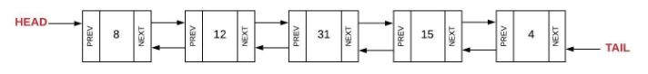

# Linked Lists

## Definition and Use Cases

A Linked List is a linear data structure, unlike lists, the elements are not stored at contiguous memory locations. The elements in a linked list are linked using pointers, which means that they store references as part of their own element.

These links can point to the next item in the array 


Or they can point to the next and previous item, creating a "Doubly Linked List" 



Linked lists are used in many real-world applications such as:

* Dynamic Memory Allocation: Linked lists can utilize memory efficiently when executing programs. Since linked lists are dynamic data structures, the size can shrink or grow as necessary.

* Implementing Stacks and Queues: Linked lists are used behind the scenes to implement other higher-level data structures like stacks and queues because of the way you insert and retrieve elements from the edges of queues and stacks, linked lists are one of the most convenient ways to implement these data structures.

- Performing Arithmetic Operations on Long Integers: Linked list can be used to add two large numbers that cannot be stored in a normal integer data type.

    Example: Imagine we want to add 2 numbers 1234 and 567, their representation as linked list would be the following 

        Number1: 1 -> 2 -> 3 -> 4
        Number2:     5 -> 6 -> 7

    Adding those 2 can give us a new linked list to represent the sum

        Result:  1 -> 8 -> 0 -> 1

* Manipulating Polynomials by Storing Coefficients and Powers: Polynomial arithmetic can be performed using linked lists where each node represents a term of the polynomial.

    Example, the polynomial 5x^3 + 4x^2 + 2 can be represented as:

        5 -> 4 -> 2

* In Graphs: Linked lists can also be used to represent graphs – Adjacency List representation of Graphs is one popular example.


## Common Operations

* Insertion: Adds an element in the list.
* Deletion: Deletes an element in the list.
* Search: Searches an element using the given key.
* Size: Return the size of the linked list

## Time Complexity (Big O Notation)

* Insertion at head or tail: O(1)
* Insertion between nodes: O(n)
* Deletion at head or tail: O(1)
* Deletion at any other node: O(n)
* Search: O(n)
* Size: O(1)

## Common Implementations

The common implementation of the linked is by using 2 classes

* A Node Class: This is a basic building block of a linked list. Each node in a linked list is an instance of the Node class. It contains the data for each element in the list

* A Linked List Class: This class represents the entire linked list. It typically contains a reference to the head of the list, and methods for the common operations

## Example of implementation

For this example we will create a simple browser history using doubly linked lists, everytime you visit a page, it has to be stored, pages have to be linked one to the other in order and the user should be able to go backwards or forwards through the browser history, if you are at the last page visited, a error message should be displayed when trying to go forwards, same logic applies to going backwards.

```python
class BrowserHistory:

    class Node:   #Inner class that handles the building blocks
        def __init__(self, data):
            self.data = data
            self.next = None
            self.prev = None

    def __init__(self):
        self.head = None
        self.current = None
        

    def visit(self, url): #Function that manages new visits
        if self.current is None:
            self.head = self.Node(url)
            self.current = self.head
        else:
            new_node = self.Node(url)
            new_node.prev = self.current
            self.current.next = new_node
            self.current = new_node

    def back(self): #Function that manages backwards movement
        if self.current != self.head:
            self.current = self.current.prev
            return self.current.data
        
        return 'This is the first page visited'

    def forward(self): #Function that manages forward movement
        if self.current.next != None:
            self.current = self.current.next
            return self.current.data
        
        return 'This is the last page visited'
    
    
################################
## Testing
################################
    
history = BrowserHistory()
history.visit('www.google.com')
history.visit('www.wikipedia.org')
history.visit('www.github.com')
print(history.forward()) #Invalid
print(history.back()) #Wikipedia
print(history.back()) #Google
print(history.back()) #Invalid
print(history.forward()) #Wikipedia
print(history.forward()) #Github

```

## Exercise

* Now as a challenge, I suggest that you create a Music playlist. In a music playlist, songs can be added, removed, and inserted in different positions in the playlist. Additionally, we often want to be able to skip to the next song or go back to the previous song, you should also add a display function that displays the remaining songs in the playlist.

* [Take a look at one possible solution for this](linked_list_exercise.py)